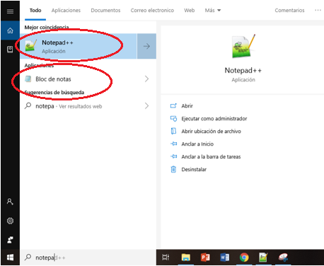
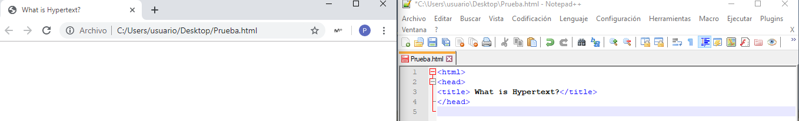

# Práctica HTML

## Introducción

HTML (HyperText Markup Language) es el primer lenguaje que una persona debe conocer si desea comenzar a realizar páginas web. HTML no es un lenguaje de programación, sino una lenguaje descriptivo, una serie de etiquetas que el navegador interpretará de una u otra forma para mostrar distintos contenidos por pantalla. 

Por tanto el HTML, es el lenguaje utilizado por el sevidor para definir las páginas del WORLD WIDE WEB. El ejemplo más claro lo encontramos precisamente en la primera página creada en la WWW: [primera página web](http://info.cern.ch/hypertext/WWW/WhatIs.html). En está veremos como esta página web está compuesta por un simple fichero HTML que a día de hoy, nuestro navegador sigue siendo capaz de leer. 

Los ficheros HTML son que pueden ser escritos con cualquier editor básico, tal como Notepad. En este fichero de texto se introducen unas marcas o caracteres de control llamadas TAGs, que son interpretadas por el navegador. Cuando éste lee un fichero con extensión *.htm o *.html interpreta estas TAGs y formatea el texto de acuerdo con ellas.

En conclusión, HTML es el lenguaje que nos sirve para crear páginas sencillas a través de una serie de TAGs que veremos a continuación:

## Notepad

Para esta práctica usaremos el programa Notepad++ y guardaremos el archivo con la extensión .html.después, clicaremos la opción de run en la barra de herramientas y seleccionaremos el navegador que deseemos, por ejemplo: "Google Chrome".

Si no posee este programa, puede emplear al Notepad  tradicional gurdar el archivo como html y ejecutarlo en el navegador que prefiera.

## TAGs básicos
Una vez abierto el Notepad, recrearemos la [primera página web](http://info.cern.ch/hypertext/WWW/WhatIs.html) e iremos viendo paso por paso que indica cada comando del HTML.

Es importante saber que el lenguaje HTML es un lenguaje completamente anidado. Esto significa que existe una gerarquía dentro de los TAGS. Cada tag empieza cuando el usuario escribe <> y termina al poner </>.

### HEAD

## Opciones más avanzadas:

<table WIDTH="90%" UNITS="relative">
  <tr>
    <td VALIGN="BASELINE"><ul>
      <li><a HREF="#form">Formularios</a></li>
      <li><a href="#radio">Botones de opciones</a></li>
      <li><a href="#check">Casillas de verificación</a></li>
    </ul>
    </td>
    <td VALIGN="BASELINE"><ul>
      <li><a href="#ventana">Ventana de selección</a></li>
      <li><a HREF="#lista">Listas</a>&nbsp;</li>
     </ul>
    </td>
  </tr>
</table>

## Formularios

<table BORDER="1" WIDTH="100%">
  <tr>
    <th><b>Así se escribe:</b></th>
    <th><b>Así se ve:</b>&nbsp;</th>
  </tr>
  <tr>
    <td WIDTH="50%"><pre>&lt;form action=&quot;query.html&quot; method=&quot;GET&quot; name=&quot;form&quot;&gt;
&lt;pre&gt;
  Nombre:&amp;nbsp;&amp;nbsp;&amp;nbsp;&amp;nbsp; &lt;input NAME=&quot;nombre&quot; size=&quot;20&quot;&gt; 
  Contraseña: &lt;input TYPE=&quot;password&quot; NAME=&quot;contrasena&quot; size=&quot;20&quot;&gt;
  &lt;input TYPE=&quot;SUBMIT&quot; VALUE=&quot;Enviar&quot;&gt; 
&lt;/pre&gt;
&lt;/form&gt;</pre>
    </td>
    <td WIDTH="50%"><form action="query.html" method="GET" name="form" target="res1">
      <pre>      Nombre:&nbsp;&nbsp;&nbsp;&nbsp; <input name="nombre" size="20"> 
      Contraseña: <input type="password" name="contrasena" size="20">
      <input type="SUBMIT" value="Enviar"> 
    </pre>
    </form>
    </td>
  </tr>
  <tr>
    <td WIDTH="50%"><pre>&lt;form action=&quot;query.html&quot;
 method=&quot;GET&quot; name=&quot;comentario&quot;&gt;
  Caja de texto de varias líneas:&lt;p&gt;
  &lt;textarea rows=&quot;3&quot; name=&quot;comentario&quot; cols=&quot;20&quot;&gt;Texto inicial&lt;/textarea&gt;
  &lt;input TYPE=&quot;SUBMIT&quot; VALUE=&quot;Enviar&quot;&gt; 
  &lt;input TYPE=&quot;RESET&quot; VALUE=&quot;Borrar&quot;&gt;
&lt;/form&gt;</pre>
    </td>
    <td WIDTH="50%"><form action="query.html" method="GET" name="comentario" target="res1">
      
Caja de texto de varias líneas:

      
<textarea rows="3" name="comentario" cols="20">Texto inicial</textarea>

      
<input type="SUBMIT" value="Enviar"> <input type="RESET" value="Borrar"> 

    </form>
    </td>
  </tr>
</table>

<iframe name="res1"></iframe>

## Botones de opciones

<table BORDER="1" WIDTH="100%">
  <tr>
    <th><b>Así se escribe:</b></th>
    <th><b>Así se ve:</b>&nbsp;</th>
  </tr>
  <tr>
    <td WIDTH="50%"><pre>&lt;form action=&quot;query.html&quot;
 method=&quot;GET&quot;    name=&quot;radio&quot;&gt;
      &lt;p&gt;Seleccione el idioma:&lt;/p&gt;
      &lt;input TYPE=&quot;radio&quot; NAME=&quot;Idioma&quot; VALUE=&quot;euskera&quot;&gt; Euskera &lt;br&gt;
      &lt;input TYPE=&quot;radio&quot; NAME=&quot;Idioma&quot; VALUE=&quot;ingles&quot;&gt; Inglés &lt;br&gt;
      &lt;input TYPE=&quot;radio&quot; NAME=&quot;Idioma&quot; VALUE=&quot;frances&quot;&gt; Francés &lt;br&gt;
      &lt;input TYPE=&quot;SUBMIT&quot; VALUE=&quot;Enviar&quot;&gt;
    &lt;/form&gt;</pre>
    </td>
    <td WIDTH="50%"><form action="query.html" method="GET" name="radio" target="res3">
      
Seleccione el idioma:

      
<input type="radio" name="Idioma" value="euskera"> Euskera  
      <input type="radio" name="Idioma" value="ingles"> Inglés  
      <input type="radio" name="Idioma" value="frances"> Francés  
      <input type="SUBMIT" value="Enviar"> 

    </form>
    </td>
  </tr>
</table>

<iframe name="res3"></iframe>

## Casillas de verificación

<table BORDER="1" WIDTH="100%">
  <tr>
    <th><b>Así se escribe:</b></th>
    <th><b>Así se ve:</b>&nbsp;</th>
  </tr>
  <tr>
    <td WIDTH="50%"><pre>&lt;form action=&quot;query.html&quot;
 method=&quot;GET&quot;  name=&quot;checks&quot;&gt;
      &lt;p&gt;Indique los idiomas que hablar:&lt;/p&gt;
      &lt;input TYPE=&quot;checkbox&quot; NAME=&quot;Idioma&quot; VALUE=&quot;euskera&quot;&gt; Euskera &lt;br&gt;
      &lt;input TYPE=&quot;checkbox&quot; NAME=&quot;Idioma&quot; VALUE=&quot;ingles&quot;&gt; Inglés &lt;br&gt;
      &lt;input TYPE=&quot;checkbox&quot; NAME=&quot;Idioma&quot; VALUE=&quot;frances&quot;&gt; Francés &lt;br&gt;
      &lt;input TYPE=&quot;SUBMIT&quot; VALUE=&quot;Enviar&quot;&gt;
&lt;/form&gt;</pre>
    </td>
    <td WIDTH="50%"><form action="query.html" method="GET" name="checks" target="res2">
      
Indique los idiomas que hablar:

      
<input type="checkbox" name="Idioma" value="euskera"> Euskera  
      <input type="checkbox" name="Idioma" value="ingles"> Inglés  
      <input type="checkbox" name="Idioma" value="frances"> Francés  
      <input type="SUBMIT" value="Enviar"> 

    </form>
    </td>
  </tr>
</table>

<iframe name="res2"></iframe>

## Ventana de selección

<table BORDER="1" WIDTH="100%">
  <tr>
    <th><b>Así se escribe:</b></th>
    <th><b>Así se ve:</b>&nbsp;</th>
  </tr>
  <tr>
    <td WIDTH="50%"><pre>&lt;form action=&quot;query.html&quot;
method=&quot;GET&quot; name=&quot;ventana&quot;&gt;
&lt;p&gt;Indique la forma de pago:&lt;/p&gt;
  &lt;p&gt;&lt;select NAME=&quot;Pago&quot; size=&quot;1&quot; &gt;
      &lt;option VALUE=&quot;metalico&quot;&gt; En metálico &lt;/option&gt;
      &lt;option VALUE=&quot;cheque&quot;&gt; Cheque &lt;/option&gt;
      &lt;option VALUE=&quot;transferencia&quot;&gt; Transferencia bancaria &lt;/option&gt;
  &lt;/select&gt; &lt;input TYPE=&quot;SUBMIT&quot; VALUE=&quot;Enviar&quot;&gt; &lt;/p&gt;
&lt;/form&gt;</pre>
    </td>
    <td WIDTH="50%"><form action="query.html" method="GET" name="ventana" target="res4">
      
Indique la forma de pago:

      
<select name="Pago" size="1">
        <option value="metalico"> En metálico </option>
        <option value="cheque"> Cheque </option>
        <option value="transferencia"> Transferencia bancaria </option>
      </select> <input type="SUBMIT" value="Enviar"> 

    </form>
    </td>
  </tr>
</table>

<iframe name="res4"></iframe>

## Listas

<table BORDER="1" WIDTH="100%">
  <tr>
    <th><b>Así se escribe:</b></th>
    <th><b>Así se ve:</b>&nbsp;</th>
  </tr>
  <tr>
    <td WIDTH="50%"><pre>&lt;form action=&quot;query.html&quot;
method=&quot;GET&quot; name=&quot;lista&quot;&gt;
&lt;p&gt;Indique la forma de pago:&lt;/p&gt;
  &lt;p&gt;&lt;select NAME=&quot;Pago&quot; size=&quot;3&quot; MULTIPLE&gt;
      &lt;option VALUE=&quot;metalico&quot;&gt; En metálico &lt;/option&gt;
      &lt;option VALUE=&quot;cheque&quot;&gt; Cheque &lt;/option&gt;
      &lt;option VALUE=&quot;transferencia&quot;&gt; Transferencia bancaria &lt;/option&gt;
  &lt;/select&gt; &lt;input TYPE=&quot;SUBMIT&quot; VALUE=&quot;Enviar&quot;&gt; &lt;/p&gt;
&lt;/form&gt;</pre>
    </td>
    <td WIDTH="50%"><form action="query.html" method="GET" name="lista" target="res5">
      
Indique la forma de pago:

      
<select name="Pago" size="3" multiple="">
        <option value="metalico"> En metálico </option>
        <option value="cheque"> Cheque </option>
        <option value="transferencia"> Transferencia bancaria </option>
      </select> <input type="SUBMIT" value="Enviar"> 

    </form>
    </td>
  </tr>
</table>

<iframe name="res5"></iframe>

&Uacute;ltima actualizaci&oacute;n: 20 de Marzo de 2019

*Ejemplo cogido de: https://nicolasserrano.github.io/CS/HTML/

http://www4.tecnun.es/asignaturas/Informat1/AyudaInf/CursoHTML/Curso01.htm

http://www4.tecnun.es/asignaturas/Informat1/AyudaInf/HTML4.0/intro/intro.html

https://tecnunhal.github.io/

https://github.com/nicolasserrano/digital/blob/master/AI.md

https://nicolasserrano.github.io/CS/

https://nicolasserrano.github.io/

https://nicolasserrano.github.io/CS/CSS/CSS.pdf
